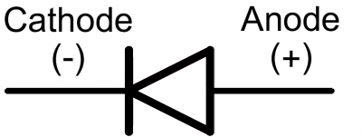
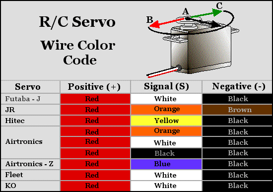
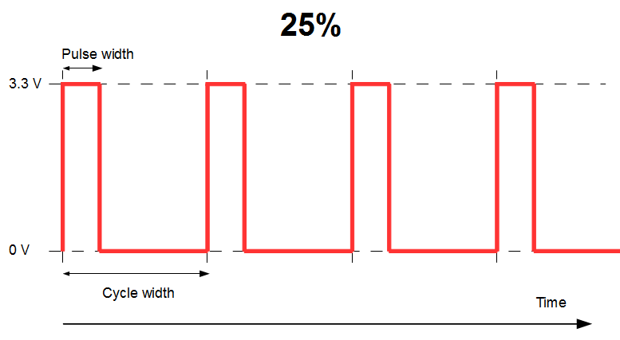
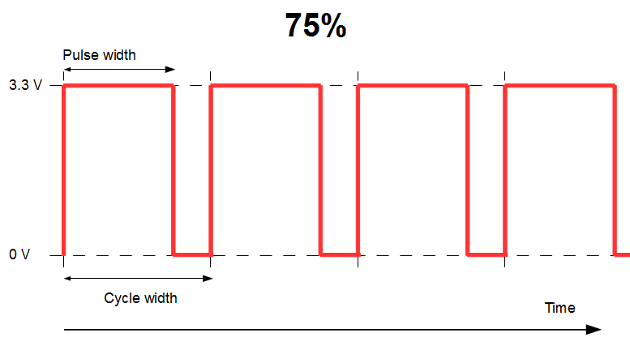

## Resistors

* <http://resistor.cherryjourney.pt>
* <https://electronicsclub.info/resistors.htm>

```
Reading resistor shorthands:

5E6 = 5R6 = 5.6Ω
56E = 56R = 56Ω
1k = 1kΩ
2k2 = 2.2kΩ
5M6 = 5.6MΩ
```

## LEDs



## Servo Motors / PWM



**PWM**: Pulse Width Modulation




* All Raspberry Pi models support a hardware `PWM` pin on `GPIO_01`.
* Raspberry Pi models `A+, B+, 2B, 3B` also support hardware `PWM` pins: `GPIO_23`, `GPIO_24`, `GPIO_26`
* <https://www.bluej.org/raspberrypi/ServoMotor.html>
* <https://learn.adafruit.com/adafruits-raspberry-pi-lesson-8-using-a-servo-motor>
* <http://razzpisampler.oreilly.com/ch05.html>

**Duty Cycle**: Percentage of time the digital signal is high over any given time period or time interval. 50% means LED is `on` 50% of the time. If a motor runs for one out of 100 seconds, or 1/100 of the time, then, its duty cycle is 1/100, or 1 percent.

## WiringPi Reference Table

    +-----+-----+---------+------+---+---Pi 3---+---+------+---------+-----+-----+
    | BCM | wPi |   Name  | Mode | V | Physical | V | Mode | Name    | wPi | BCM |
    +-----+-----+---------+------+---+----++----+---+------+---------+-----+-----+
    |     |     |    3.3v |      |   |  1 || 2  |   |      | 5v      |     |     |
    |   2 |   8 |   SDA.1 |   IN | 1 |  3 || 4  |   |      | 5v      |     |     |
    |   3 |   9 |   SCL.1 |   IN | 1 |  5 || 6  |   |      | 0v      |     |     |
    |   4 |   7 | GPIO. 7 |   IN | 1 |  7 || 8  | 1 | IN   | TxD     | 15  | 14  |
    |     |     |      0v |      |   |  9 || 10 | 1 | IN   | RxD     | 16  | 15  |
    |  17 |   0 | GPIO. 0 |   IN | 0 | 11 || 12 | 0 | IN   | GPIO. 1 | 1   | 18  |
    |  27 |   2 | GPIO. 2 |   IN | 0 | 13 || 14 |   |      | 0v      |     |     |
    |  22 |   3 | GPIO. 3 |   IN | 0 | 15 || 16 | 0 | IN   | GPIO. 4 | 4   | 23  |
    |     |     |    3.3v |      |   | 17 || 18 | 0 | IN   | GPIO. 5 | 5   | 24  |
    |  10 |  12 |    MOSI |   IN | 0 | 19 || 20 |   |      | 0v      |     |     |
    |   9 |  13 |    MISO |   IN | 0 | 21 || 22 | 0 | IN   | GPIO. 6 | 6   | 25  |
    |  11 |  14 |    SCLK |   IN | 0 | 23 || 24 | 1 | IN   | CE0     | 10  | 8   |
    |     |     |      0v |      |   | 25 || 26 | 1 | IN   | CE1     | 11  | 7   |
    |   0 |  30 |   SDA.0 |   IN | 1 | 27 || 28 | 1 | IN   | SCL.0   | 31  | 1   |
    |   5 |  21 | GPIO.21 |   IN | 1 | 29 || 30 |   |      | 0v      |     |     |
    |   6 |  22 | GPIO.22 |   IN | 1 | 31 || 32 | 0 | IN   | GPIO.26 | 26  | 12  |
    |  13 |  23 | GPIO.23 |   IN | 0 | 33 || 34 |   |      | 0v      |     |     |
    |  19 |  24 | GPIO.24 |   IN | 0 | 35 || 36 | 0 | IN   | GPIO.27 | 27  | 16  |
    |  26 |  25 | GPIO.25 |   IN | 0 | 37 || 38 | 0 | IN   | GPIO.28 | 28  | 20  |
    |     |     |      0v |      |   | 39 || 40 | 0 | IN   | GPIO.29 | 29  | 21  |
    +-----+-----+---------+------+---+----++----+---+------+---------+-----+-----+
    | BCM | wPi |   Name  | Mode | V | Physical | V | Mode | Name    | wPi | BCM |
    +-----+-----+---------+------+---+---Pi 3---+---+------+---------+-----+-----+

* <https://pinout.xyz/pinout/pin40_gpio21#>

## Misc

* <https://storiknow.com/automatic-cat-feeder-using-raspberry-pi-part-four>
